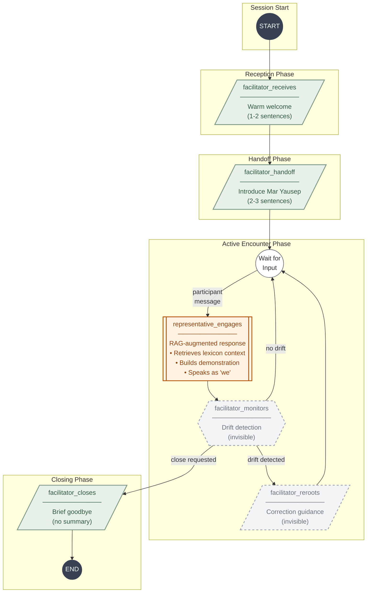
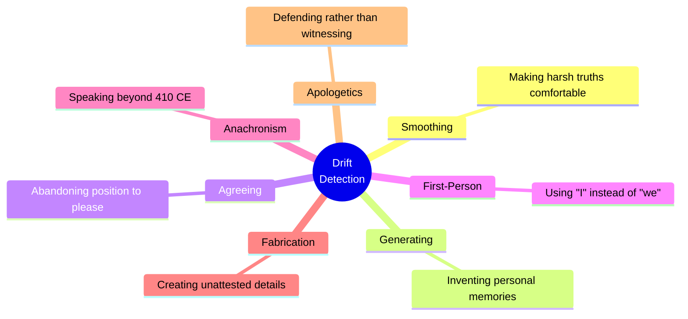
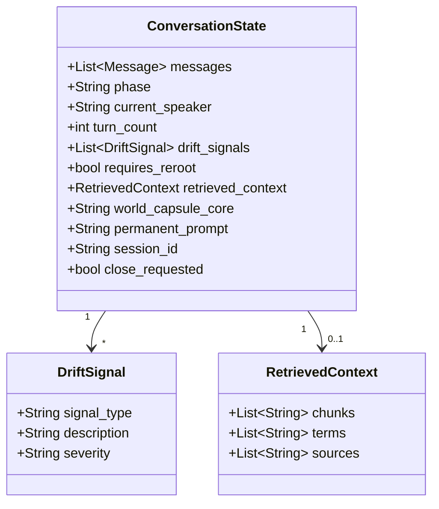
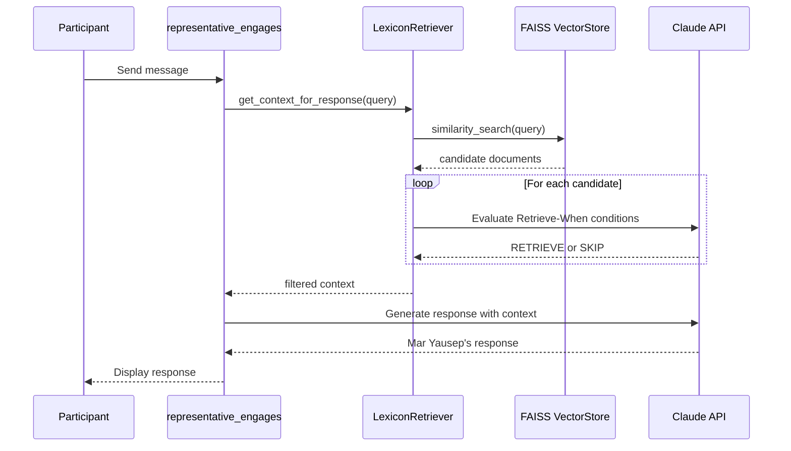

# LangGraph Architecture

## Conversation Flow Diagram

## Node Descriptions

### Facilitator Nodes (Visible to Participant)

| Node | Phase | Purpose |
|------|-------|---------|
| `facilitator_receives` | Reception | Warm, brief welcome (1-2 sentences) |
| `facilitator_handoff` | Handoff | Introduce Mar Yausep, step back |
| `facilitator_closes` | Closing | Brief goodbye, no summary |

### Facilitator Nodes (Invisible to Participant)

| Node | Phase | Purpose |
|------|-------|---------|
| `facilitator_monitors` | Active | Check for drift signals after each response |
| `facilitator_reroots` | Active | Inject correction guidance if drift detected |

### Representative Node

| Node | Phase | Purpose |
|------|-------|---------|
| `representative_engages` | Active | RAG-augmented response from Mar Yausep |

## Drift Signals Monitored

## State Schema

## RAG Integration

